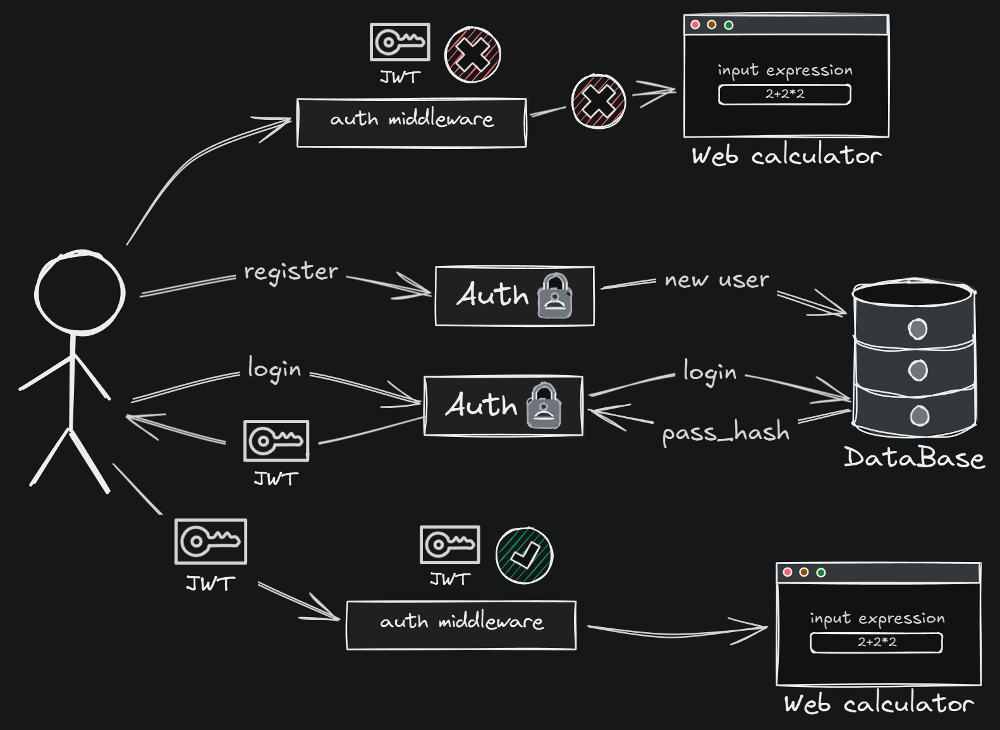
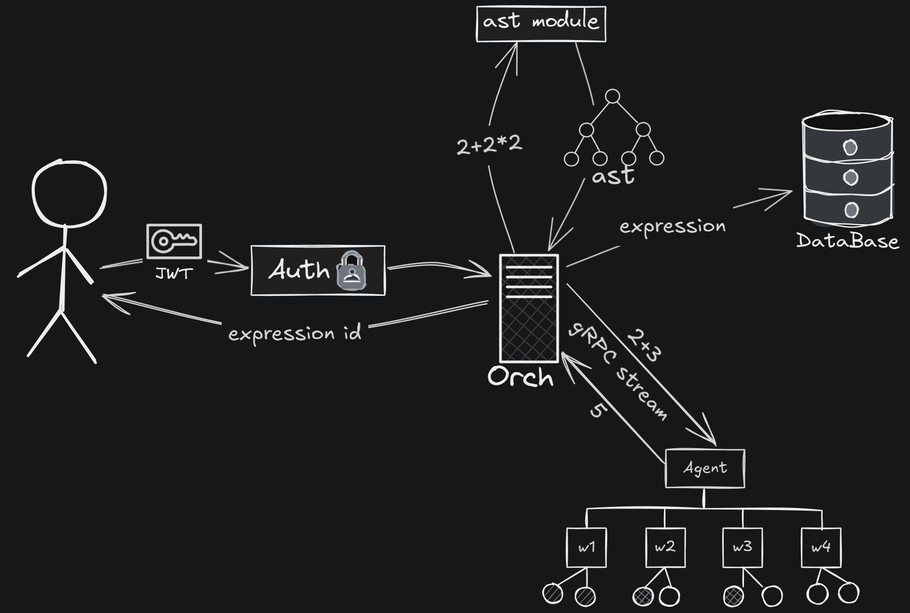
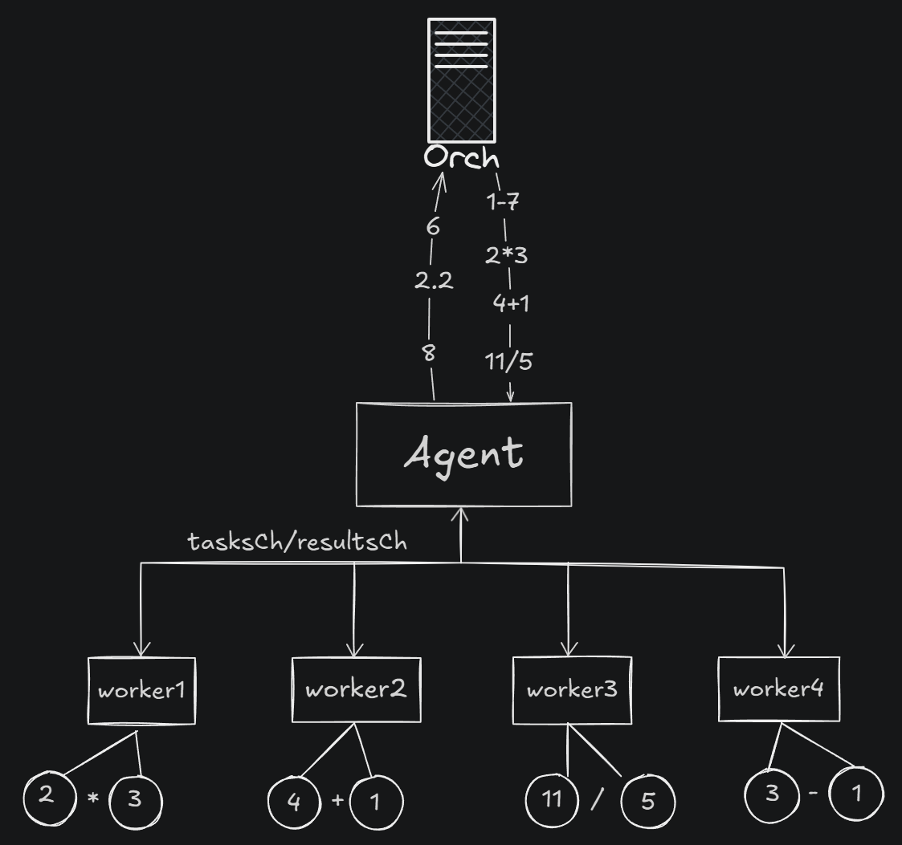

# Распределенный вычислитель арифметических выражений с авторизацией

## О проекте
Данный проект представляет собой систему для параллельного вычисления арифметических выражений в распределенной среде с авторизацией пользователей.
Вычисление выполняется агентом. Он создает указанное количество воркеров, которые одновременно считают бинарные выражения из основного(-ых) выражения(-й).

## Структура проекта
```
api/
  ├── gen/
  │   └── go/
  │       ├── calculation_grpc.pb.go
  │       └── calculation.pb
  ├── proto/
  │   └── calculation.proto
cmd/
  ├── agent/
  │   ├── cmd.go
  │   ├── Dockerfile
  ├── orchestrator/
  │   ├── cmd.go
  │   ├── Dockerfile
internal/
  ├── agent/
  │   ├── agent.go
  │   ├── grpc.stream_agent.go
  │   ├── worker.go
  │   └── worker_test.go
  ├── config/
  │   └── config.go
  ├── models/
  │   └── models.go
  ├── orchestrator/
  │   ├── calculator.go
  │   ├── calculator_test.go
  │   ├── grpc.stream_orch.go
  │   ├── grpc.stream_orch_test.go
  │   ├── handlers.go
  │   └── orchestrator.go
pkg/
  ├── ast/
  │   ├── ast.go
  │   ├── ast_test.go
  │   ├── build.go
  │   ├── errors.go
  │   ├── errors_test.go
  │   ├── rpn.go
  │   ├── rpn_test.go
  │   ├── tokens.go
  │   ├── tokens_test.go
  │   └── vars.go
  ├── crypo
  │   ├── password/
  │   │   ├── password.go
  │   │   └── password_test.go
  │   └── jwt/
  │       ├── jwt.go
  │       └── jwt_test.go
  ├── database/
  │   ├── sql.db.go
  │   └── sql.db_test.go
  ├──data/
  └──images/
      ├── image.png
      ├── image-2.png
      └── image-3.png
.gitignore
docker-compose.yml
go.mod
go.sum
README.md
```

## Требования
Перед запуском убедитесь, что у вас установлено:
### Вариант с Docker (рекомендуется)
- **Docker** версия 24.0 или выше  
  [Скачать Docker](https://www.docker.com/get-started)
- **Docker Compose** (обычно входит в Docker)
### Вариант без Docker

- **Go** версия 1.20+  
  [Скачать Go](https://golang.org/dl/)
- **Компилятор Protocol Buffers (protoc)**  
  [Скачать Компилятор ProtoBuf](https://protobuf.dev/installation/)


## Установка и запуск проекта
### Установка
1. Клонируйте репозиторий
```sh
git clone https://github.com/vedsatt/distributed-expr-calculator.git
cd ./distributed-expr-calculator
```
Установите зависимости
```sh
go mod tidy
```
### Запуск
1. **Создайте файл `.env`** в корневой папке и укажите в нем параметры:
```sh
TIME_ADDITION_MS=<ЗНАЧЕНИЕ>
TIME_SUBTRACTION_MS=<ЗНАЧЕНИЕ>
TIME_MULTIPLICATIONS_MS=<ЗНАЧЕНИЕ>
TIME_DIVISIONS_MS=<ЗНАЧЕНИЕ>
COMPUTING_POWER=<ЗНАЧЕНИЕ>
ORCHESTRATOR_ADDRESS=<ЗНАЧЕНИЕ> // "localhost:5000" без Docker; "orchestrator:5000" с Docker
```
**Примечание:** если не создать файл и/или не указать определенные значения, то программа установит неуказанные значения по умолчанию (для адреса подключения к оркестратору будет установлено значение для локального подключения)

### С помощью Go:

1. **Запустите оркестратор:**
```sh
go run ./cmd/orchestrator/cmd.go
```
2. **Запустите агента:**
```sh
go run ./cmd/agent/cmd.go
```

### С помощью Docker:
**Разверните контейнеры с помощью docker-compose:**
```sh
docker-compose up --build
```

## Дизайн системы
### Оркестратор
Перед отправкой выражения пользователю необходимо зарегистрироваться. После регистрации необходимо войти. Если аутентификация прошла успешно - вам будет выдан JWT токен, который должен быть в заголовке "Authorization" запроса. Также сервер устанавливает куки, которые браузер (или инструмент для тестирования API) сохраняет для следующих запросов, что упрощает доступ в систему. Если попытаться отправить выражение без токена или куки, то доступ будет заблокирован.


Когда пользователь отправляет выражение на сервер, программа строит по выражению AST дерево и возвращает пользователю id выражения (если найдена ошибка, то она возвращается пользователю вместо id). Выражение добавляется в базу со статусом "in proccess" и начинается расчет.

Расчет происходит следующим образом: программа строит хеш-таблицу по AST дереву, для дальнейшей работы. Далее программа проходится по дереву, находя узлы, которые могут быть посчитаны и отправляет их в канал tasks. Агент подключается к серверу с помощью gRPC стрима. Он получает значение из канала tasks, и, когда агент отдает результат значения, сервер отправляет его в канал results. Программа берет результат из этого канала, меняет значение посчитанного узла и удаляет его ветки (то есть, узлы с операндами). Это делается в хеш-таблице, поскольку ее ключи - айди узлов, а значения - указатели на узлы дерева. Таким образом, меняя значение в хэш-таблице, мы меняем значение и в дереве. После этого программа заново обходит дерево и повторяет предыдущие действия, пока окончательный результат не будет посчитан. Когда в мапе (хеш-таблице) остается 1 значение - это сигнализирует о том, что все дерево было посчитано. В таком случае программа отправляет конечный результат в канал и обновляет значение в базе данных.


Чтобы у сервера была возможность обрабатывать несколько выражений от разных пользователей одновременно, каждое выражение - это объект со своими каналами tasks и results. Существует менеджер каналов, который создает пары каналов и с помощью мапы определяет выражение, результат подвыражения которого отправил агент после подсчета. (Подробнее менеджер описан в самом коде) 

### Агент
При старте агент запускает несколько горутин и подключается к серверу с помощью gRPC стриминга. Когда сервер отправляет выражение, агент перенаправляет его в канал tasks. Воркер, который получил выражение, считает его, формирует ответ из результата (и ошибки, если требуется) и  отправляет его в канал results. Агент перенаправляет подсчитанный результат на сервер. Если выражение посчитано корректно - поле ошибки будет пустым, а результат будет иметь значение и наоборот.


## Компоненты системы
### Оркестратор
Оркестратор отвечает за прием арифметических выражений, разбиение их на отдельные операции и отправку бинарных подзадач задач агенту.  

#### API Оркестратора
**Примечение: вы можете использовать куки, которые устанавливаются сервером, чтобы не использовать токен вручную.**
- **Регистрация**
```sh
curl --location 'localhost:8080/api/v1/register' \
--header 'Content-Type: application/json' \
--data '{
  "login": "<ваш логин>"
  "password": "<ваш пароль>"
}'
```
**Ответ:**
**StatusCode 200**  
*или:*
```json
{
    "error": <ошибка>
}
```
- **Логин**
```sh
curl --location 'localhost:8080/api/v1/login' \
--header 'Content-Type: application/json' \
--data '{
  "login": "ваш_логин"
  "password": "ваш_пароль"
}'
```
**Ответ:**
```json
{
    "jwt": <ваш_токен>
} 
```
*или:*
```json
{
    "error": <ошибка>
}
```
- **Добавление вычисления арифметического выражения**
```sh
curl --location 'localhost:8080/api/v1/calculate' \
--header 'Content-Type: application/json' \
--header 'Authorization: Bearer ваш_токен' \
--data '{
  "expression": "2+2*2"
}'
```
**Ответ:**
```json
{
    "id": <уникальный идентификатор выражения>
}
```
*или:*
```json
{
    "error": <ошибка>
}
```

- **Получение списка выражений**
```sh
curl --location 'localhost:8080/api/v1/expressions' \
--header 'Authorization: Bearer ваш_токен'
```
**Ответ:**
```json
{
    "expressions": [
        {
            "id": <идентификатор выражения>,
            "status": <статус вычисления выражения>,
            "result": <результат выражения>
        }
    ]
}
```
*или:*
```json
{
    "error": <ошибка>
}
```

- **Получение выражения по его идентификатору**
```sh
curl --location 'localhost:8080/api/v1/expressions/id' \
--header 'Authorization: Bearer ваш_токен'
```
**Ответ:**
```json
{
    "expression": {
        "id": <идентификатор выражения>,
        "status": <статус вычисления выражения>,
        "result": <результат выражения>
    }
}
```
*или:*
```json
{
    "error": <ошибка>
}
```

---

### Агент
Агент получает задачи от оркестратора, выполняет их и отправляет обратно результаты.
Агент запускает несколько вычислительных горутин, количество которых регулируется переменной `COMPUTING_POWER`.

## Примеры запросов и ответов для сервера
### 1. Регистрация
**Запрос:**
```sh
curl --location 'localhost:8080/api/v1/register' \
--header 'Content-Type: application/json' \
--data '{
  "login": "vedsatt"
  "password": "123"
}'
```

**Код ответа:**
- 200 - Пользователь зарегистрирован успешно

**Запрос:**
```sh
curl --location 'localhost:8080/api/v1/register' \
--header 'Content-Type: application/json' \
--data '{
  "login": "vedsatt"
  "password": ""
}'
```
**Ответ:**
```json
{
    "error": "password cannot be empty"
}
```

**Код ответа:**
- 403 - Пустой пароль

**Запрос:**
```sh
curl --location 'localhost:8080/api/v1/register' \
--header 'Content-Type: application/json' \
--data '{
  "login": "vedsatt"
  "password": "123"
}'
```
**Ответ:**
```json
{
    "error": "user already exists"
}
```

**Код ответа:**
- 403 - Пользователь уже зарегистрирован

---
### 2. Вход
**Запрос:**
```sh
curl --location 'localhost:8080/api/v1/login' \
--header 'Content-Type: application/json' \
--data '{
  "login": "vedsatt"
  "password": "123"
}'
```
**Ответ:**
```json
{
    "jwt": "<very.secret.token>"
}
```
**Код ответа:**
- 200 - Пользователь вошел успешно

**Запрос:**
```sh
curl --location 'localhost:8080/api/v1/login' \
--header 'Content-Type: application/json' \
--data '{
  "login": "vedsatt"
  "password": ""
}'
```
**Ответ:**
```json
{
    "error": "incorrect password"
}
```

**Код ответа:**
- 403 - Неправильный пароль

**Запрос:**
```sh
curl --location 'localhost:8080/api/v1/login' \
--header 'Content-Type: application/json' \
--data '{
  "login": "devastated"
  "password": "123"
}'
```
**Ответ:**
```json
{
    "error": "user not fuond"
}
```

**Код ответа:**
- 403 - Пользователь не найден

---

### 3. Добавление вычисления арифметического выражения
**Запрос:**
```bash
curl --location 'localhost:8080/api/v1/calculate' \
--header 'Content-Type: application/json' \
--data '{
  "expression": "2 + 2 * 2"
}'
```

**Ответ:**
```json
{
    "error": "invalid token"
}
```

**Код ответа:**
- 201 - выражение принято для вычисления

**Запрос:**
```bash
curl --location 'localhost:8080/api/v1/calculate' \
--header 'Content-Type: application/json' \
--header 'Authorization: Bearer ваш_токен'
--data '{
  "expression": "2 + 2 * 2"
}'
```

**Ответ:**
```json
{
    "id": 1
}
```

**Код ответа:**
- 201 - выражение принято для вычисления

**Запрос:**
```bash
curl --location 'localhost:8080/api/v1/calculate' \
--header 'Content-Type: application/json' \
--header 'Authorization: Bearer ваш_токен'
--data '{
  "exp":
}'
```

**Ответ:**
```json
{
    "error": "internal server error"
}
```

**Код ответа:**
- 500 - некорректный запрос

---

### 4. Получение списка выражений

**Запрос:**
```bash
curl --location 'localhost:8080/api/v1/expressions' \
--header 'Authorization: Bearer ваш_токен'
```

**Ответ:**
```json
{
    "expressions": [
        {
            "id": 2,
            "status": "in process",
            "result": ""
        },
        {
            "id": 1,
            "status": "done",
            "result": 6.0000
        }
    ]
}
```

**Код ответа:**
- 200 - успешно получен список выражений

**Запрос:**
```bash
curl --location 'localhost:8080/api/v1/expressions' \
--header 'Authorization: Bearer ваш_токен'
```

**Ответ:**
```json
{
    "error":"you haven't calculated any expressions yet"
}
```

**Код ответ:**
- 500 - база данных пустая

---

### 5. Получение выражения по его идентификатору

**Запрос:**
```bash
curl --location 'localhost:8080/api/v1/expressions/1'
```

**Ответ:**
```json
{
    "expression": {
        "id": 1,
        "status": "in proccess",
        "result": ""
    }
}
```

**Код ответа:**
- 200 - успешно получено выражение

**Запрос:**
```bash
curl --location 'localhost:8080/api/v1/expressions/5'
```

**Ответ:**
```json
{
    "error":"expression does not exist"
}
```

**Код ответа:**
- 404 - Такого выражения не существует (в контексте конкретного пользователя или в целом в бд)
  
## Контакты
Если у вас возникли вопросы или предложения, можете написать их в issue или написать мне лично в тг:
```
https://t.me/sigmatemik52
```
